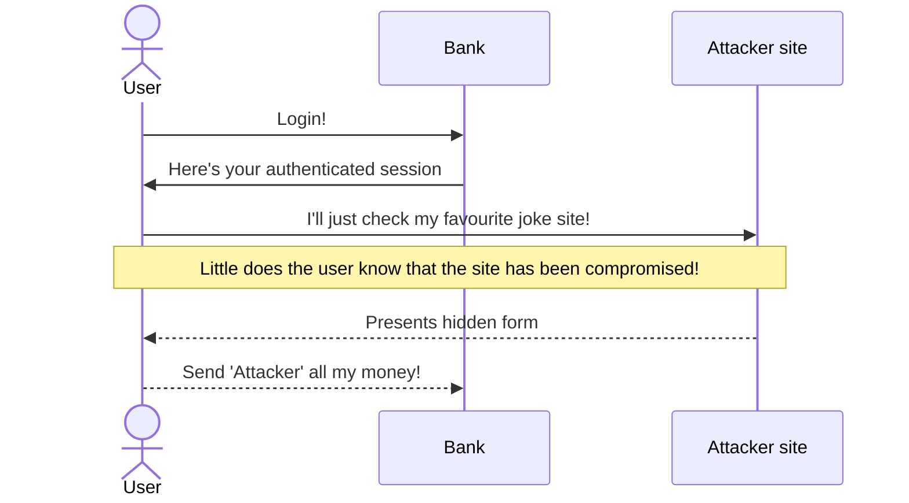

## Approach
- the server trusts the user's [[browser]]
- specifically, if the session is authenticated, then the server tends to accept any state-changing requests


- apparently this is partly because of [[GET]] requests being used for state-changing actions
	- THAT'S NOT WHAT THEY'RE FOR
	- Devs learn what methods to use for what purpose challenge 2024
### example (disapproving)
Imagine there's a route/view on a server. In Flask, we might have:
```python
@route('/change-email', methods=['GET'])
def change_email(new_email:str):
  new_email = request.args['newEmail]
  if request.user is authenticated:
    User.objects.get(user).email = new_email
    User.save()
```
And that means that if an authenticated user clicked on this link, or even accesses a website where this url is in hidden...
`http://example.com/change-email?newEmail=bad-guy@example.com`
...and the server doesn't have any kind of CSRF protection, then it'll merrily update the user's email address without any complaint.

You can also do this via a [[POST]] request, as long as the user has [[JavaScript]] turned on. You put in a hidden form and have the script submit it.

## mitigation
- use the fucking libraries
- I swear, just don't try building this shit from scratch
- anti-CSRF tokens, which ensure that requests originate from a page on the domain, rather than externally
- same-site cookies
- re-authentication for expensive transactions


