OAuth 2.0 is a framework for [[authorisation]]. It is not designed for [[authentication]].

## Objectives
Provider B provides some user Alice resources on a resource server (RS), and an authorisation server (AS).

Alice wishes to allow a client device, hosted in Provider A, authority to access her resources in Provider B.

The mechanism by which we will do this is by providing some token to the client device that it can use to prove authorisation to the RS.

## Approach
The AS needs to know what resources it is authorising for. Additionally, clients must be registered with the AS, in which case they will be granted a clientid and, possibly, a secret (which, bluntly, is a [[password]] by any other name). The client application will use these to authenticate itself to the AS.

## Modes
- authorisation code grant mode, often simply shorted to 'code mode'

```mermaid
sequenceDiagram

User ->> Client: I would like to share this with my friends on Mastodon :)
Client ->> User: Sure thing! Let's go over there
User ->> AS: (redirected) Log in :)
AS ->> User: It's you! Are you sure you want to authorise Client?
User ->> AS: Yup!
AS ->> User: Okay! Here's the authorisation code
User ->> Client: (redirected) For you 😊
Client ->> AS: exchange code for access token
AS ->> Client: here's your token
Client ->> RS: Gimme stuff, here's my token
```

## Securing OAuth
We can't reuse the protections we use against [[CSRF]], because we are intentionally requesting cross-site.