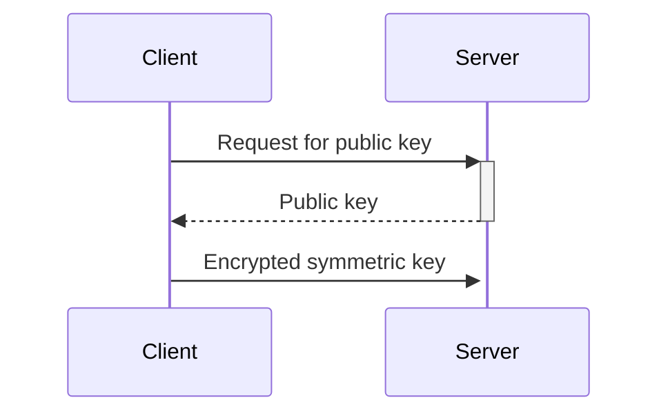

A protocol for securing connections, particularly over the internet. It is also sometimes known as [[SSL]], though this is incorrect: SSL is the earliest, pre-1.0 versions of TLS

## [[security service]]
### Needs:
- [[confidentiality]] - naturally
- [[data origin authentication]] - we need to be confident that data is coming from where it's supposed to
- [[entity authentication]] - we need to be sure that things are who they say they are
### Doesn't need:
- [[non-repudiation]]

TLS requires a reliable underlying transport protocol. Applications on the [[Internet]] running over the [[Transmission Control Protocol]] are therefore a simple fit for TLS. 

>[!note]
>The [[Internet]] is often modelled as a four-layer [[Internet Protocol Suite]]. While TLS oeprates at the [[Transport Layer]] of the Internet Protocol Suite, secure channels can also be established at the higher [[Application Layer]] using the [[Secure Shell]] protocol, or at the lower [[Internet Layer]] using the [[Internet Protocol Security]] suite.

### [[security service]] we'll need
TLS security requirements are for [[confidentiality]], [[data origin authentication]], [[entity authentication]]. 

### Protocol

This allows for the smallest use of expensive [[asymmetric]] encryption, while ensuring we don't need to have a shared secret with every retailer in the world. Imagine how big your book of passwords would get!