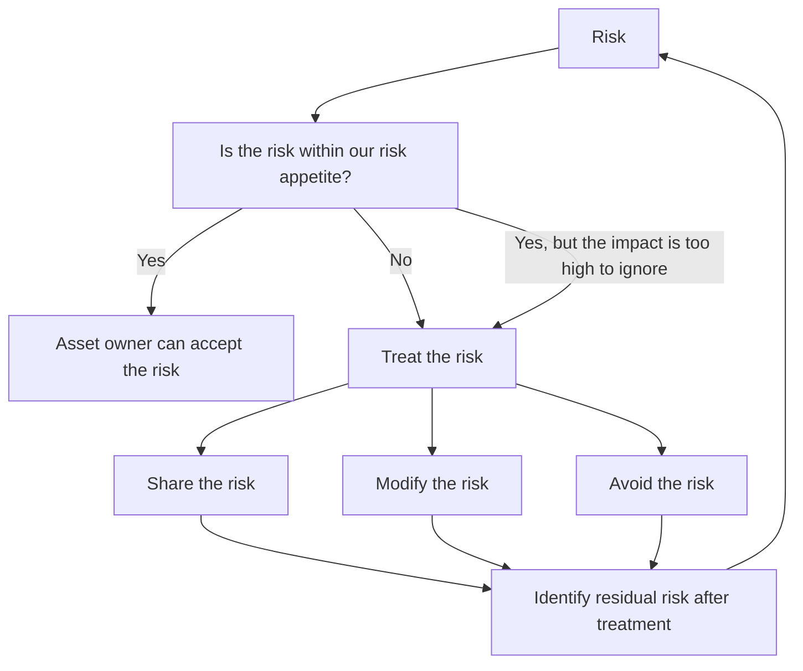

Some approaches to treating [[risk]] following a [[risk assessment]]

## options
- modification: risk reduction by some control. These controls might be 
	- preventative, whereby we try to prevent a risk occuring
	- reactive controls, which occur after a breach or incident has occured
- acceptance: we'll live with it
- sharing: subcontracting some risk to others
	- don't love this, and it should be considered in the context of reputational risk
- risk avoidance: just stop doing the risky thing

## choosing your treatment

Risk modification is the most common of these, and is implemented through [[control|security controls]].